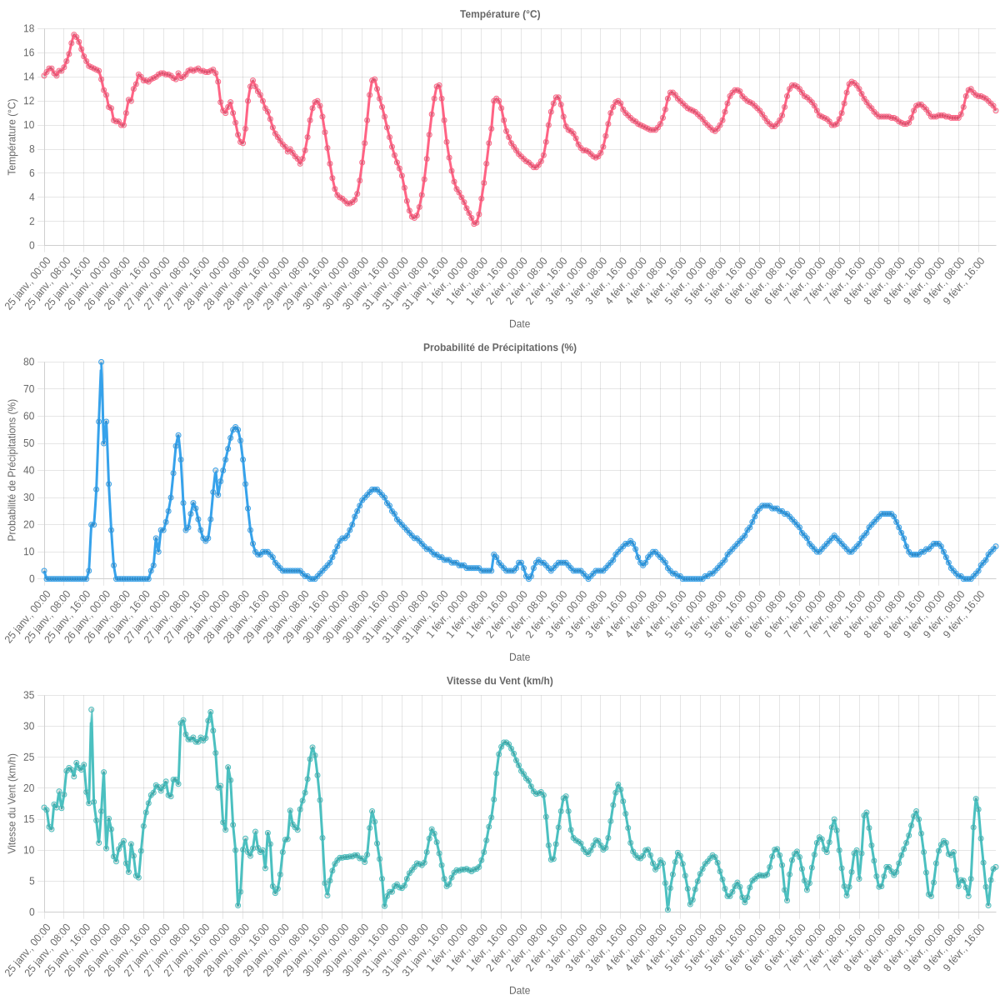

[](https://github.com/RomainChanteloup/discord-weather/actions/workflows/jarvis.yml)



# Discord Weather Bot
A simple side project for testing GitHub Action and sending weather updates to Discord.

## Introduction
This is a small bot called Jarvis, which is open source. It uses the Open-Meteo API to fetch weather data and sends it to a Discord channel.

## Features
* Fetches weather data from Open-Meteo API
* Sends weather updates to a Discord channel
* Uses GitHub Action for automated testing

## How it works
1. The bot uses the `discord.js` library to connect to Discord and send messages.
2. It uses the `https` module to make API calls to Open-Meteo.
3. The `graph_gen.js` file generates a chart based on the weather data with the lib chartJS.
4. The bot sends the chart to the Discord channel.

## Usage
To use this bot, you'll need to:
1. Create a Discord bot token and add it to your environment variables.
2. Create a GitHub Action workflow to automate testing.
3. Set up a Discord channel for the bot to send updates to.

## Code
The code for this bot is located in the `index.js` file.

## Environment Variables
The bot uses the following environment variables:
- `DISCORD_BOT_TOKEN` 
- `CLIENT_ID`

## Starting the Bot
To start the bot, navigate to the project directory in your terminal and run the following commands:
```bash
npm install
npm start
```
This will install libs and start the bot, it will send weather updates to the specified Discord channel.
